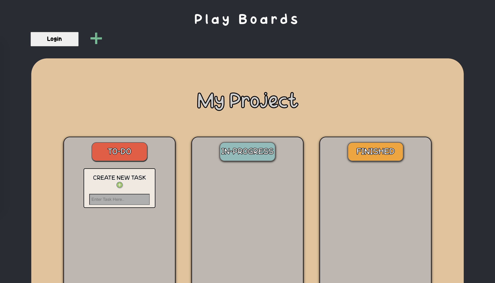

# playBoards

Interactive and fun way to visualize todo lists.

Changelog
10/21/2022

* Migrated and rewrote codebase to be in Typescript.
* Implemented Redux ToolKit over classic Redux

---> Always trying to modularize and organize codebase for readability <---

Features:
* Seperate Tasks 
* Create Multiple Boards
* State Persists
* Sign up / Login

To Do:
* Organize and sort boards into folders.
* Change background colors
* Save background colors.

